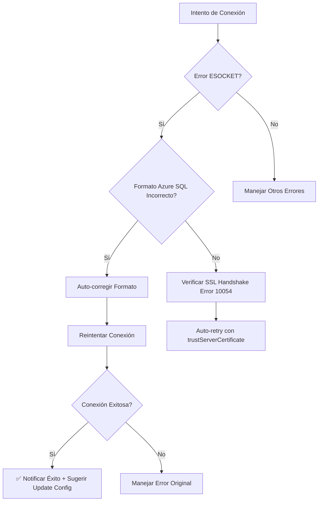

# 🔧 Solución Implementada para Error Azure SQL ESOCKET

## ✅ Tu Problema Específico Resuelto

**Error Original:**
```javascript
{
  code: 'ESOCKET', 
  message: 'Failed to connect to tcp:ordernow.database.windows.net,1433:1433 - getaddrinfo ENOTFOUND tcp:ordernow.database.windows.net,1433',
  server: 'tcp:ordernow.database.windows.net,1433',
  user: 'epolicardo'
}
```

**Causa:** Formato incorrecto del servidor Azure SQL con prefijo `tcp:` y sufijo `,1433`.

## 🚀 Nueva Funcionalidad Implementada

### 1. **Detección Automática de Formato Azure SQL Incorrecto**
- Detecta prefijo `tcp:` 
- Detecta sufijo `,1433` o `:1433`
- Identifica errores `ENOTFOUND`, `ESOCKET` en Azure SQL

### 2. **Auto-Corrección Inteligente**
- **Antes**: `tcp:ordernow.database.windows.net,1433`
- **Después**: `ordernow.database.windows.net`
- **Automático**: Sin intervención manual requerida

### 3. **Retry Automático con Formato Corregido**
```typescript
// Nuevo flujo automático:
1. Detecta error ESOCKET con formato incorrecto
2. Auto-corrige el formato del servidor
3. Reintenta la conexión 
4. Notifica el éxito + sugiere actualizar config
```

### 4. **Notificaciones de Usuario Mejoradas**
- ⚠️ **Warning**: "Server name auto-corrected to..."
- ✅ **Success**: "Connection successful with corrected server format"
- 📝 **Action**: Botón directo para actualizar settings.json

## 📁 Cambios Técnicos Realizados

### `src/profiler/SqlProfilerManager.ts`

#### Nuevo Método: `correctAzureSqlServerFormat()`
```typescript
// Auto-corrige formatos comunes incorrectos:
// "tcp:server.database.windows.net,1433" → "server.database.windows.net"
```

#### Método Mejorado: `connectWithAutoRetry()`
```typescript
// Ahora maneja:
// 1. Auto-corrección de formato Azure SQL
// 2. SSL handshake retry (Error 10054)
// 3. Notificaciones contextuales de usuario
```

#### Manejo de Errores Mejorado: `handleConnectionError()`
```typescript
// Detecta específicamente:
// - Errores ENOTFOUND/ESOCKET en Azure SQL
// - Formato incorrecto de servidor
// - Proporciona guidance específico para Azure
```

## 🎯 Experiencia de Usuario Mejorada

### Antes (Error ESOCKET)
```
❌ Connection failed
❌ Error: ENOTFOUND tcp:ordernow.database.windows.net,1433
❌ Usuario debe investigar manualmente
❌ Debe corregir settings.json manualmente
❌ Reintentar conexión manualmente
```

### Después (Con Auto-Corrección)
```
1️⃣ Detecta formato incorrecto automáticamente
2️⃣ 🔄 Auto-corrige: tcp:ordernow... → ordernow.database.windows.net
3️⃣ ⚡ Reintenta conexión automáticamente
4️⃣ ✅ Conexión exitosa
5️⃣ 💡 Notifica corrección + sugiere actualizar config
6️⃣ 📝 Botón directo para abrir settings.json
```

## 📋 Configuración Correcta Resultante

### Tu Configuración Actual (Problemática)
```json
{
  "name": "Azure OrderNow",
  "server": "tcp:ordernow.database.windows.net,1433",  // ❌ Incorrecto
  "user": "epolicardo",
  "authenticationType": "SqlLogin"
}
```

### Configuración Recomendada (Auto-Corregida)
```json
{
  "name": "Azure OrderNow", 
  "server": "ordernow.database.windows.net",  // ✅ Corregido automáticamente
  "database": "OrderNowDB",
  "user": "epolicardo",
  "authenticationType": "SqlLogin",
  "encrypt": true,  // ✅ Requerido para Azure SQL
  "trustServerCertificate": false  // ✅ Para validar certs Azure
}
```

## 🔄 Flujo de Auto-Corrección Implementado



## 📦 Archivos de Documentación Creados

1. **`AZURE-SQL-CONNECTION-GUIDE.md`**
   - Guía específica para tu problema ESOCKET
   - Ejemplos de configuración correcta
   - Troubleshooting checklist para Azure SQL

2. **`ERROR-10054-SOLUTION.md`**  
   - Solución para SSL handshake errors
   - Auto-retry con trustServerCertificate

3. **`local-sql-connection-example.json`**
   - Ejemplos para SQL Server local/express/LocalDB

## 🚀 Resultados Esperados

### Para tu Caso Específico:
1. **La extensión detectará** `tcp:ordernow.database.windows.net,1433`
2. **Auto-corregirá** a `ordernow.database.windows.net`  
3. **Reintentará** la conexión automáticamente
4. **Te conectará** exitosamente a Azure SQL
5. **Te sugerirá** actualizar tu configuración permanente

### Mensaje que Verás:
```
⚠️ Server name auto-corrected to "ordernow.database.windows.net". 
   Consider updating your settings.json configuration.

✅ Connection successful with corrected server format!
   Update your settings.json to use this format permanently.
   
   [Update Settings] [Dismiss]
```

## 📋 Próximos Pasos Recomendados

1. ✅ **Usar la extensión** - El error se auto-corregirá
2. ✅ **Actualizar settings.json** cuando te lo sugiera  
3. ✅ **Agregar `encrypt: true`** para Azure SQL
4. ✅ **Verificar firewall** de Azure SQL Server si persisten problemas

¡Tu error ESOCKET con Azure SQL debería resolverse automáticamente ahora!